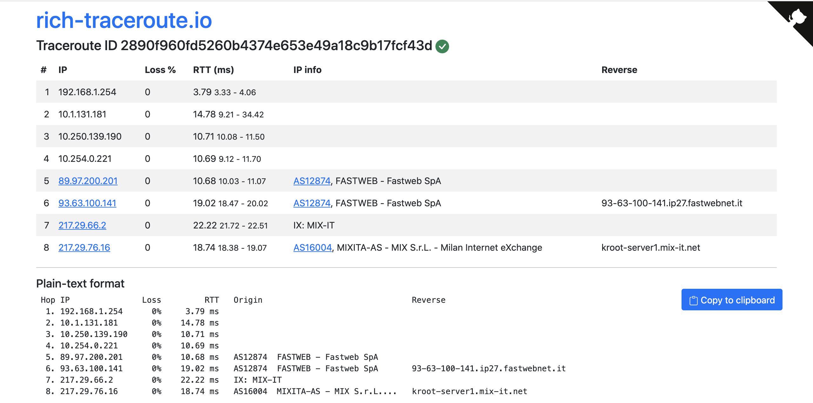

rich-traceroute
===============

|Build Status| |Code coverage|

Just a tool to enrich the output of traceroutes.

You can paste the output of your traceroute command, and it enriches it with additional information, like the origin ASNs of the IPs and the name of any Internet Exchange peering LAN that shows up in the path.

Also, it produces a *normalised* plain-text output that contains all the information above.

The online version is reachable at https://rich-traceroute.io

Bug? Issues? Support requests?
------------------------------

But also suggestions? New ideas?

Please create an `issue on GitHub <https://github.com/pierky/rich-traceroute/issues>`_ or `drop me a message <https://pierky.com/#contactme>`_.

Author
------

Pier Carlo Chiodi - https://pierky.com

Blog: https://blog.pierky.com Twitter: `@pierky <https://twitter.com/pierky>`_

.. |Build Status| image:: https://github.com/pierky/rich-traceroute/actions/workflows/tests.yml/badge.svg?branch=master
    :target: https://github.com/pierky/rich-traceroute/actions/workflows/tests.yml

.. |Code coverage| image:: https://codecov.io/gh/pierky/rich-traceroute/branch/master/graph/badge.svg?token=ASJC1WPMT8
    :target: https://codecov.io/gh/pierky/rich-traceroute
